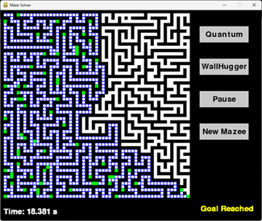

# Quantum Maze Solver

## Project Overview
This project focuses on leveraging quantum algorithms to solve maze navigation problems efficiently. The goal is to demonstrate the superior performance of quantum-inspired maze-solving algorithms compared to traditional methods like depth-first and breadth-first search. By utilizing quantum principles such as superposition and recursive splitting, the maze solver optimizes pathfinding in complex mazes, with potential applications in network optimization, robotics, and artificial intelligence.

## Features
- **Maze Generation**: Generates random mazes using a depth-first search algorithm with added loops for complexity.
- **Quantum Solver**: Implements a quantum-inspired algorithm that explores multiple paths simultaneously using agent-based modeling.
- **Left Turn Solver**: A traditional wall-following algorithm for comparison with the quantum approach.
- **Interactive Interface**: Built with Pygame, allowing users to select solvers, pause/resume simulations, and regenerate mazes.
- **Performance Metrics**: Displays time taken to solve the maze, visualized with a timer and "Goal Reached" indicator.

## Installation
1. **Clone the Repository**:
   ```bash
   git clone https://github.com/LostLuinor/quantum-maze-solver.git
   cd quantum-maze-solver
   ```

2. **Install Dependencies**:
   Ensure Python 3.8+ is installed, then install the required libraries:
   ```bash
   pip install pygame mesa
   ```

3. **Run the Program**:
   Execute the main script to start the maze solver:
   ```bash
   python maze_solver.py
   ```

## Usage
- **Launch the Application**: Run the script to open the Pygame window.
- **Select a Solver**:
  - Click "Quantum" to use the quantum-inspired solver.
  - Click "WallHugger" to use the left-turn wall-following solver.
- **Pause/Resume**: Click "Pause" to pause or resume the simulation.
- **Generate New Maze**: Click "New Maze" to create a new random maze.
- **Exit**: Close the window or press the close button to exit.

## Code Structure
- **maze_solver.py**: Main script containing the maze generation, solver algorithms, and Pygame interface.
- **QuantumPlayer Class**: Implements the quantum-inspired solver using agent-based modeling with MESA.
- **LeftTurnPlayer Class**: Implements the traditional wall-following algorithm.
- **MazeModel Class**: Manages the simulation grid and agent scheduling using MESA.
- **Utility Functions**: Includes functions for maze generation, drawing, and user interface elements.

## Results
The quantum-inspired solver outperformed traditional algorithms in navigating complex mazes, as detailed in the project report. The solver efficiently handles intricate paths, with performance visualized through the Pygame interface showing agent paths and completion time.


## Future Work
- Extend the quantum algorithm to handle larger and dynamic mazes.
- Integrate with other algorithms for hybrid approaches.
- Explore real-time applications in robotics and network optimization.
